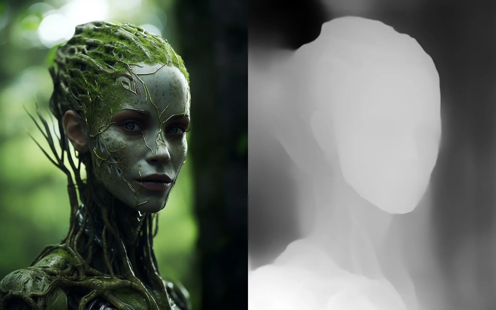

# Midas

[Midas][1] unlocks real-time monocular depth estimation with MiDaS models running in Unity Sentis.

To get started, please see the [Getting Started](manual/getting-started.md) page. The package also provides a number of samples that can be imported via the Package Manager.

[1]: https://assetstore.unity.com/packages/slug/268501