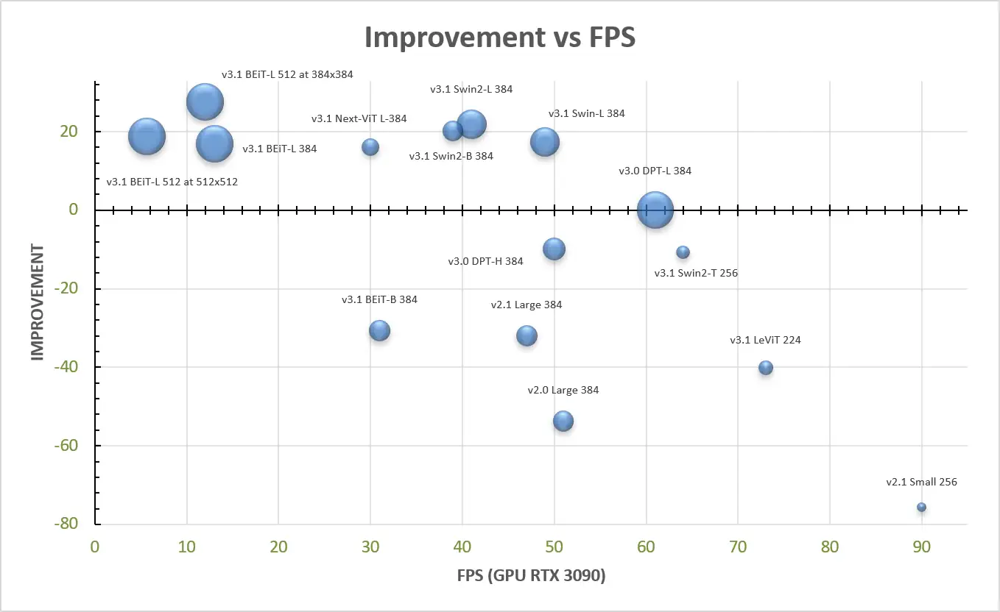

# MiDaS Models

There are variety of different MiDaS models available. To be able to use them with Unity Sentis, the official models were converted to ONNX using [this colab notebook][colab]. You'll find links to the pretrained models in ONNX format below.

## Overview

| Model Type                    | Size     | MiDaS Version   |
|-------------------------------|----------|-----------------|
| [midas_v21_small_256][1]      | 63 MB    | 2.1             |
| [midas_v21_384][2]            | 397 MB   | 2.1             |
| [dpt_beit_large_512][3]       | 1.34 GB  | 3.1             |
| [dpt_beit_large_384][4]       | 1.34 GB  | 3.1             |
| [dpt_beit_base_384][5]        | 450 MB   | 3.1             |
| [dpt_swin2_large_384][6]      | 832 MB   | 3.1             |
| [dpt_swin2_base_384][7]       | 410 MB   | 3.1             |
| [dpt_swin2_tiny_256][8]       | 157 MB   | 3.1             |
| [dpt_swin_large_384][9]       | 854 MB   | 3.1             |
| [dpt_next_vit_large_384][10]  | 267 MB   | 3.1             |
| [dpt_levit_224][11]           | 136 MB   | 3.0             |
| [dpt_large_384][12]           | 1.27 GB  | 3.0             |

## Usage

To keep the package size reasonable, only the @Doji.AI.Depth.ModelType.midas_v21_small_256 model is included with the package when downloading from the Asset Store. To use other models you have to downloaded them first.

When you create an instance of the @Doji.AI.Depth.Midas class you can pass the @Doji.AI.Depth.ModelType in the constructor to choose which model to use. In the Unity Editor if you're about to use a model that is not yet present, you will automatically be prompted to allow the file download.

Otherwise you can always manually download the ONNX models from the links above and place them inside the Resources/ONNX folder.

## Which Model To Use

You should choose the appropriate model type based on your requirements, considering factors such as accuracy, model size and performance.

The available models usually have a tradeoff between memory & performance and the accuracy/quality of the depth estimation.

The [official MiDaS documentation][docs_official] does a fairly good job of showcasing the different capabilities, so I'll just copy the performance overview here:

Generally, if you have a hard realtime requirement, e.g. when you want to do depth estimation at runtime or on mobile devices, you may want to use smaller models like midas_v21_small_256 or dpt_swin2_tiny_256. If you need best quality (editor tools) or depth estimation needs to happen just once, you might be able to use models like dpt_swin2_large_384 or dpt_beit_large_384. Keep in mind the larger memory requirements for these model though.

[colab]: https://github.com/julienkay/com.doji.midas/blob/master/tools/MiDaS_ONNX_Export.ipynb
[docs_official]: https://github.com/isl-org/MiDaS
[1]: https://github.com/julienkay/com.doji.midas/releases/download/v1.0.0/midas_v21_small_256.onnx
[2]: https://github.com/julienkay/com.doji.midas/releases/download/v1.0.0/midas_v21_384.onnx
[3]: https://github.com/julienkay/com.doji.midas/releases/download/v1.0.0/dpt_beit_large_512.onnx
[4]: https://github.com/julienkay/com.doji.midas/releases/download/v1.0.0/dpt_beit_large_384.onnx
[5]: https://github.com/julienkay/com.doji.midas/releases/download/v1.0.0/dpt_beit_base_384.onnx
[6]: https://github.com/julienkay/com.doji.midas/releases/download/v1.0.0/dpt_swin2_large_384.onnx
[7]: https://github.com/julienkay/com.doji.midas/releases/download/v1.0.0/dpt_swin2_base_384.onnx
[8]: https://github.com/julienkay/com.doji.midas/releases/download/v1.0.0/dpt_swin2_tiny_256.onnx
[9]: https://github.com/julienkay/com.doji.midas/releases/download/v1.0.0/dpt_swin_large_384.onnx
[10]: https://github.com/julienkay/com.doji.midas/releases/download/v1.0.0/dpt_next_vit_large_384.onnx
[11]: https://github.com/julienkay/com.doji.midas/releases/download/v1.0.0/dpt_levit_224.onnx
[12]: https://github.com/julienkay/com.doji.midas/releases/download/v1.0.0/dpt_large_384.onnx